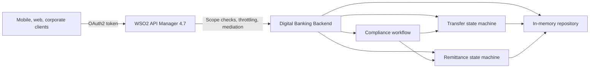

# Digital Banking Platform Demo

A maintainable Node.js backend and OpenAPI 3.0 contract set for a digital banking demonstration through **WSO2 API Manager 4.7**. The sample customers, GTQ/USD products, payment rails, addresses, and remittance flows are based on a realistic banking scenario in Guatemala, while all API, service, container, and fictional institution names remain generic.

The service is intentionally self-contained and uses deterministic in-memory state. It can run as:

1. A direct backend behind WSO2 API Manager 4.7; or
2. A replacement/extension for the `banking-backend-js` layer in the existing `demo-banking` repository.

All customer names, banks, identifiers, policy thresholds, rates, and transactions are fictional.

## Deliverables

- Node.js/Express backend with domain services and an in-memory repository.
- Aggregate OpenAPI 3.0.3 source plus eight standalone context contracts with operation IDs, schemas, examples, OAuth2 scopes, ETags, idempotency headers, and problem details.
- GET, POST, PUT, and PATCH scenarios.
- Dockerfile and Docker Compose packaging.
- Automated domain tests and executable cURL demo flow.
- APIM 4.7 deployment guidance.

## Start

```bash
cp -n .env.example .env
docker compose down --remove-orphans
docker compose up --build -d
docker compose ps
curl http://localhost:8080/health
```

Follow startup logs when the service is not healthy:

```bash
docker compose logs -f banking-backend
```

Collect a complete local diagnostic report with:

```bash
./scripts/diagnose.sh
```

Verify that APIM can resolve the Docker backend endpoint:

```bash
./scripts/verify-apim-backend.sh
```

Interactive documentation and contracts:

- Aggregate Swagger UI: `http://localhost:8080/docs`
- Contract catalog: `http://localhost:8080/openapi`
- Aggregate contract: `http://localhost:8080/openapi.yaml`
- Context contract example: `http://localhost:8080/openapi/transfers.yaml`

The contract files intentionally declare the Docker-network backend `http://banking-backend:8080` for APIM import. Invoke the backend directly from the host with `http://localhost:8080`, or invoke it through the APIM gateway after deployment.

Run the complete scenario after the health endpoint reports `UP`:

```bash
./scripts/demo.sh
```

Reset at any time:

```bash
curl -X POST http://localhost:8080/admin/reset
```

## Architecture



The original repository routes browser and agent traffic through APIM, then Micro Integrator, and finally a JavaScript mock core-banking backend. This implementation preserves the mock-core responsibility but allows direct APIM exposure because the requested scope is backend plus OpenAPI only. An MI mediation layer can still be inserted without changing the contract.

See [Architecture and engineering decisions](docs/ARCHITECTURE.md).

## Domain capabilities

| Domain | Capabilities |
|---|---|
| Customers | Read and partially update contact/profile data using `PATCH` + `If-Match` |
| Accounts | GTQ/USD balances, standardized masked identifiers, ledger entries, mutable limits |
| Beneficiaries | Internal, domestic external, and regional external; create with `POST`, replace with `PUT` |
| Cards | Read status and modify block/channel controls with `PATCH` |
| Transfers | Internal, CCA, LBTR, and SIPA; fund holds, limits, maker-checker, compliance, settlement, rejection, cancellation, return |
| Remittances | USD-to-GTQ quote, registration, duplicate protection, compliance review, account-credit payout |
| Compliance | Manual/automatic cases, assignment, notes, resolution, atomic linked-workflow advancement |
| Administration | Deterministic snapshot and reset for repeatable demonstrations |

## Key endpoints

| Method | Path | Purpose |
|---|---|---|
| GET / PATCH | `/v1/customers/{customerId}` | Read or update a customer |
| GET | `/v1/customers/{customerId}/accounts` | List customer accounts |
| GET / POST | `/v1/customers/{customerId}/beneficiaries` | List or create beneficiaries |
| PUT | `/v1/customers/{customerId}/beneficiaries/{beneficiaryId}` | Fully replace a beneficiary |
| GET | `/v1/accounts/{accountId}` | Read balances and limits |
| PATCH | `/v1/accounts/{accountId}/limits` | Change account limits |
| GET / PATCH | `/v1/cards/{cardId}` | Read or update card controls |
| GET / POST | `/v1/transfers` | Search or initiate transfers |
| GET / PATCH | `/v1/transfers/{transferId}` | Read or advance a transfer workflow |
| POST | `/v1/remittances/quotes` | Create a time-limited remittance quote |
| GET / POST | `/v1/remittances` | Search or register remittances |
| GET / PATCH | `/v1/remittances/{remittanceId}` | Read or operate a remittance |
| GET / POST | `/v1/compliance/cases` | Search or open cases |
| GET / PATCH | `/v1/compliance/cases/{caseId}` | Read or operate a case |

The aggregate source is [openapi/banking-platform-api.yaml](openapi/banking-platform-api.yaml). The independently importable contracts and their APIM contexts are listed in [openapi/README.md](openapi/README.md).

## Seed data

| ID | Role |
|---|---|
| `CUS-GT-001` | Retail customer with GTQ/USD accounts, card, domestic/internal/regional beneficiaries |
| `CUS-GT-002` | Retail customer in Quetzaltenango |
| `CUS-GT-003` | Business customer with enhanced due diligence and high demo risk rating |
| `ACC-GTQ-001` | Retail GTQ monetary account |
| `ACC-USD-001` | Retail USD savings account for SIPA demo |
| `ACC-GTQ-003` | Business GTQ account for high-value/compliance demo |
| `BEN-GT-001` | Domestic external GTQ beneficiary |
| `BEN-GT-002` | Internal GTQ beneficiary |
| `BEN-GT-004` | Regional USD beneficiary in El Salvador |
| `BEN-GT-005` | Business domestic supplier beneficiary |
| `CARD-GT-001` | Retail debit card with mutable controls |

## Concurrency and safe mutation

Mutable resources return an `ETag` such as `"2"`. Clients must send that value in `If-Match` for `PUT` and `PATCH`:

```bash
curl -i http://localhost:8080/v1/cards/CARD-GT-001

curl -X PATCH http://localhost:8080/v1/cards/CARD-GT-001 \
  -H 'If-Match: "1"' \
  -H 'Content-Type: application/json' \
  -d '{"controls":{"internationalEnabled":true}}'
```

A stale version returns `412 VERSION_MISMATCH`. Missing `If-Match` returns `428 IF_MATCH_REQUIRED`.

Transfer and remittance creation require `Idempotency-Key`. Replaying the same body returns the original resource; reusing the key with a different body returns `409 IDEMPOTENCY_KEY_REUSED`.

## Demo policy configuration

The following values are configurable in `.env`:

```dotenv
MAKER_CHECKER_THRESHOLD_GTQ=25000
AML_REVIEW_THRESHOLD_GTQ=50000
BENEFICIARY_COOLING_HOURS=24
REMITTANCE_REVIEW_THRESHOLD_USD=2000
REMITTANCE_QUOTE_TTL_MINUTES=10
USD_TO_GTQ_RATE=7.75
REMITTANCE_FEE_USD=4.99
```

These are **fictional demo controls**, not statements of Guatemalan law, central-bank operating rules, reporting thresholds, or bank policy.

## WSO2 API Manager 4.7

See [APIM setup](docs/APIM-SETUP.md). Import the eight context contracts as separate APIs. Each uses version `1.0.0` and the same production endpoint on the shared Docker network: `http://banking-backend:8080`.

The contracts already contain WSO2 endpoint extensions and generic base paths. Do not replace the Docker endpoint with `localhost:8080`; `localhost` inside the APIM container refers to APIM itself. Previously imported country-prefixed APIs should be recreated from the new contracts so their API names, contexts, endpoint configuration, and deployed revisions are all clean.

The backend intentionally does not parse or validate OAuth tokens. APIM should enforce authentication, subscriptions, application/API keys as appropriate, scopes, throttling, CORS, and security mediation.

## Development

```bash
cd backend
npm install
npm test
npm start
```

Runtime requirement: Node.js 20 or later. The Docker image uses Node.js 22 Alpine and runs as a non-root user with dropped Linux capabilities and a read-only root filesystem in Compose.

Tests use Node's built-in test runner and do not depend on a live HTTP server:

```bash
cd backend
node --test
```

## Repository layout

```text
.
├── backend/
│   ├── src/
│   │   ├── data/             # deterministic fictional seed
│   │   ├── domain/           # explicit workflow state machines
│   │   ├── middleware/       # context, logs, problem details
│   │   ├── repositories/     # transactional in-memory store
│   │   ├── routes/           # HTTP adapters only
│   │   ├── services/         # business use cases
│   │   └── utils/            # money, validation, HTTP, idempotency
│   ├── scripts/          # contract generation and validation
│   ├── test/
│   ├── openapi/          # runtime copies of aggregate and context contracts
│   └── Dockerfile
├── docs/
├── openapi/              # source contract, split contracts, and context catalog
├── scripts/
├── docker-compose.yml
└── .env.example
```

## Important limitations

This is a demonstration backend, not production core-banking software:

- State is local to one process and disappears on restart/reset.
- It is not horizontally scalable because the store is not shared.
- Transactions are synchronous in-process rollback snapshots, not database ACID transactions.
- CCA, LBTR, and SIPA settlement is simulated; no external network is contacted.
- Exchange rates, fees, verification, sanctions, AML, fraud, signatures, and regulatory reporting are simplified.
- Authentication and authorization are delegated to APIM for the demo.
- Account and identity values are masked fictional data.

A production evolution should introduce a durable database, outbox/event publication, external payment adapters, HSM-backed signing, real customer-consent and entitlement checks, reconciliation, immutable audit storage, observability, secrets management, and disaster-recovery design.

## References used for scenario grounding

- Original demo repository: https://github.com/joaokuntzwso2/demo-banking/
- Banco de Guatemala payment systems: https://banguat.gob.gt/page/sistemas-de-pago
- Banco de Guatemala account standardization: https://banguat.gob.gt/page/estandarizacion-de-cuentas
- Banco de Guatemala family remittances: https://banguat.gob.gt/page/remesas-familiares-0
- WSO2 APIM OpenAPI import documentation: https://apim.docs.wso2.com/en/latest/api-design-manage/design/create-api/create-rest-api/create-a-rest-api-from-an-openapi-definition/
